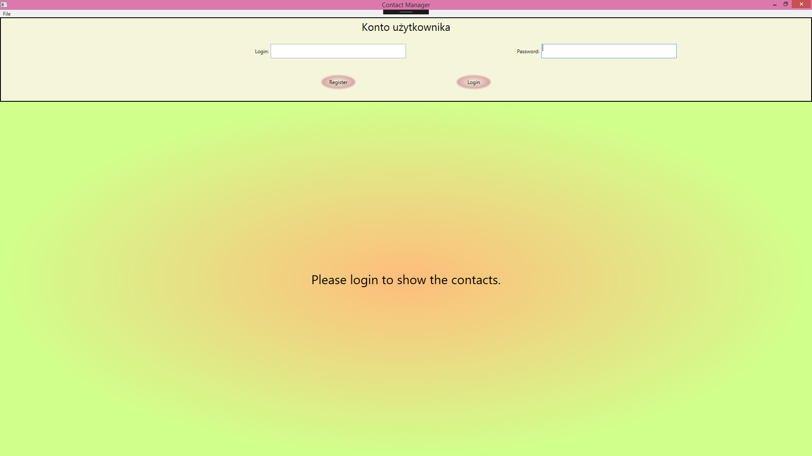
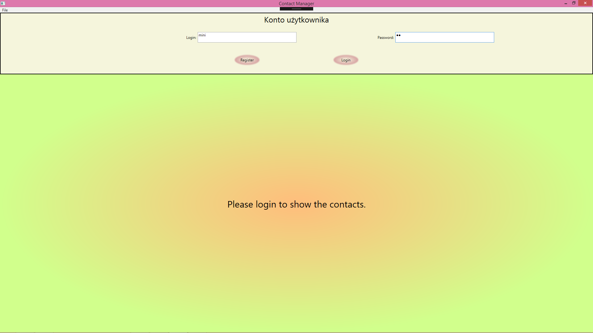
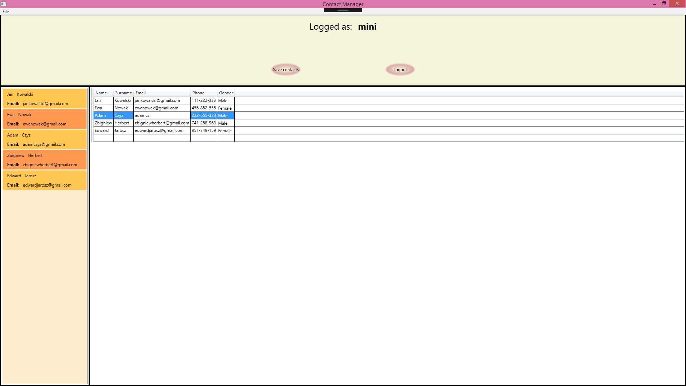
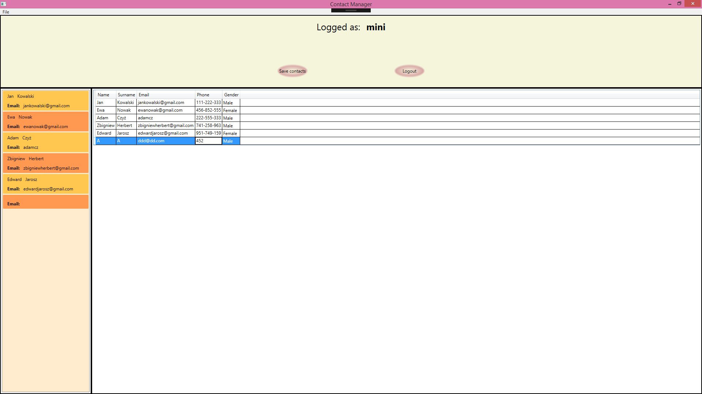
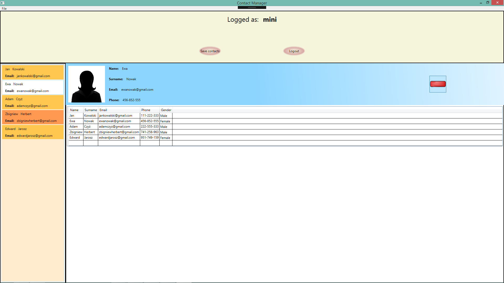
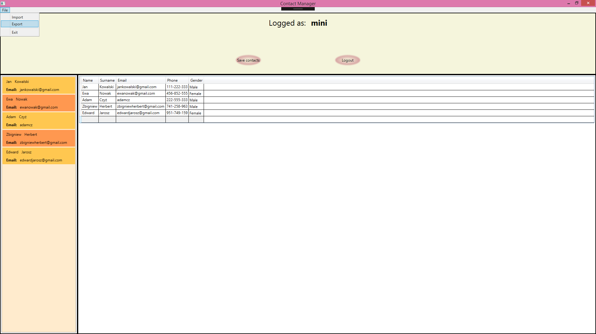
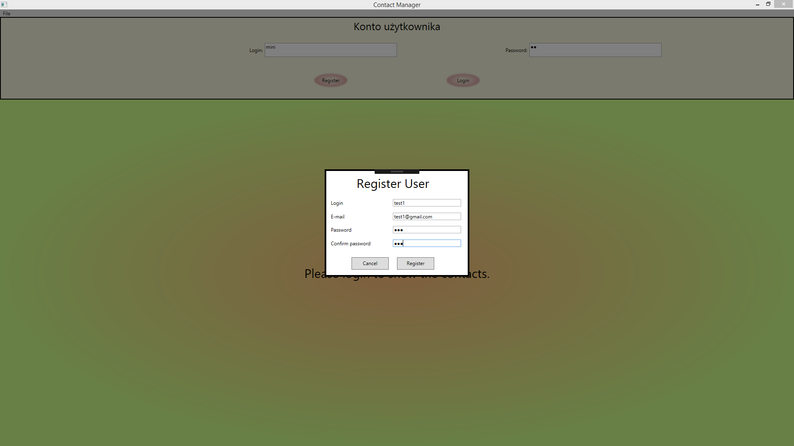

# Contact-manager
Aplikacja umożliwia użytkownikom zarządzanie swoimi kontaktami. 

Dostęp do bazy kontaktów jest możliwy po zalogowaniu, aplikacja może być używana przez wielu użytkowników posiadających unikalny login.

Centralny ekran służy do edycji istniejących kontaktów oraz dodawania nowych.

Dodawanie kontaktów jest możliwe poprzez dopisanie kontaktu w ostatnim, wolnym rekordzie.

Każdy kontakt posiada swoją wizytówkę, którą można wyświetlić poprzez wybranie go z lewej listy. 

Program posiada funkcję importu i eksportu bazy kontaktów indywidualnie dla każdego użytkownika. 

Do aplikacji może zostać dodany nowy użytkownik z poziomu ekranu logowania.

